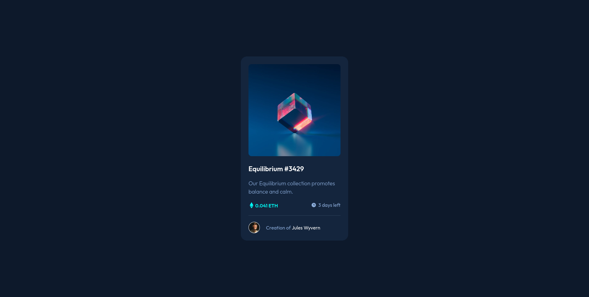
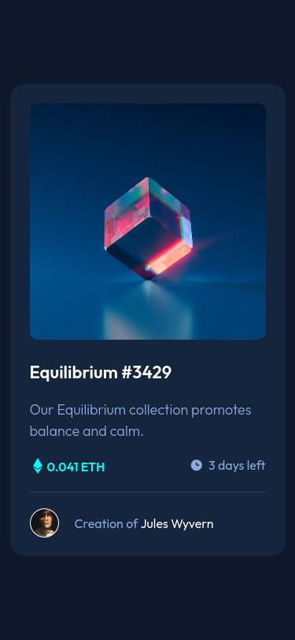

# Frontend Mentor - NFT Preview Card Component Solution

This is a solution to the [NFT Preview Card Component Challenge on Frontend Mentor](https://www.frontendmentor.io/challenges/nft-preview-card-component-SbdUL_w0U). Frontend Mentor challenges help you improve your coding skills by building realistic projects.

## Table of Contents

- [Overview](#overview)
  - [The Challenge](#the-challenge)
  - [Screenshots](#screenshot)
  - [Links](#links)
- [My Process](#my-process)
  - [Built With](#built-with)
  - [What I Learned](#what-i-learned)
  - [Continued Development](#continued-development)
  - [Useful Resources](#useful-resources)
- [Author](#author)

## Overview

### The Challenge

Users should be able to:

- View the optimal layout depending on their device's screen size
- See hover states for interactive elements

### Screenshots

- Desktop View
  


- Mobile View



### Links

- Solution URL: [NFT preview card component](https://www.frontendmentor.io/solutions/nft-preview-card-component-PP6ZL4XmE)
- Live Site URL: [nft-preview-card-component-fm](https://nft-preview-card-component-fm.netlify.app/)

## My Process

### Built with

- Semantic HTML5 markup
- CSS custom properties
- Flexbox
- CSS Grid
- Mobile-first workflow

### What I Learned

- Building this project I learned how to create an overlay over an image and positioning of the overlay effectively for all screensizes. Also this taught me the effective use of ::after(:after) and ::before(:before) [pseudo-elements](https://developer.mozilla.org/en-US/docs/Web/CSS/Pseudo-elements).

- The CSS below uses the ::after(:after) pseudo-element to create the cyanic colored overlay over the NFT image on hover.

```css
/* color overlay styling starts */
.image-container:hover::after {
    height: 300px;
    width: 300px;
    position: absolute;
    transform: translateX(-100%);
    content: "";
    background-color: var(--img_overlay_col);
    border-radius: 10px;
}
/* color overlay styling ends */
```

- The CSS below uses the ::before(:before) pseudo-element to create the view-icon overlay over the NFT image on hover.

```css
/* icon overlay styling starts */
.image-container:hover::before {
    height: 300px;
    width: 300px;
    position: absolute;
    transform: translate(43%, 43%);
    content: "";
    background-image: url(/images/icon-view.svg);
    background-repeat: no-repeat;
    z-index: 1;
}
/* icon overlay styling ends */
```

### Continued development

Building this project, I really struggled with how positioning of an element works and I will be focussing more and try to refine more on the topic.

### Useful resources

- [MDN Web Docs](https://developer.mozilla.org/en-US/) - The Mozilla Development Network Documentation really helped me with the CSS, I like how the documentation contains various interactive examples of the concept which helps in understanding the concepts much better.

## Author

- Frontend Mentor - [@d02ev](https://www.frontendmentor.io/profile/d02ev)
- Twitter - [@devvikramaditya](https://www.twitter.com/devvikramaditya)
